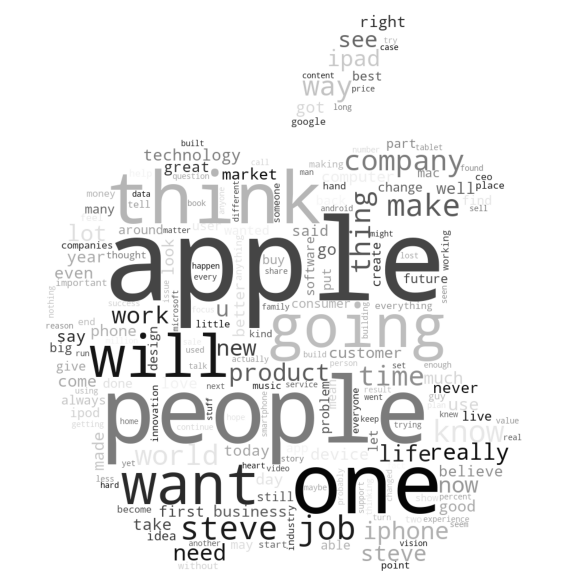

# What is the role of the media coverage in explaining stock market fluctuations?

The full data story can be found here: [www.thepandariders.com](https://thepandariders.com/). For the best experience we would recommend you to use Google Chrome and avoid Safari. Enjoy!

### Abstract and research questions


Apple has been a market leader in the world of technology ever since the launch of its first product. Furthermore, media are more and more being used to study their impact on stock market movements. In this project, we aim to show that the rises and falls in stock prices of Apple correlate to the extent that people are talking about Apple in the media, the way people are talking about the company, and the fame of the speakers. Firstly, we will wonder what is the role of the media coverage in explaining stock market fluctuations? Then, we will examine what is the influence of the people's opinions about Apple expressed in the media on the stock market? Eventually, we will add a last level of complexity and we will ask who are the individuals who have influence over potential customers, and do these notorious influencers have an impact on the company image and eventually, on the stock market?

***
### Data sets used : 
* `Quotebank DataSet` : To investigate the reciprocal relationships between the fluctuations of the Apple stock market and media coverage related to this company, we study mentions of Apple using time series analysis. We filter out any quotes that are not related to the company, the products or its direction board. The filtered dataset is then saved as a pickle file containing approximately 300.000 quotes out of the original 234 millions. This new dataset provides a great preview of Apple mentions in the media. We will then analyse to what extent Apple is mentioned according to time in the media, who are the speakers talking about this company and the way they are talking about it.
* `Wikipedia API` : We use the Wikipedia API to recover informations about the speakers. We will classify them as having a significant influence or a low influence over potential customers based on the Wikipedia page view statistics per year. The idea is to get all the Wiki qids speakers that have have spoken in our filtered quotes dataset. Then, with the Wikipedia API, we would get all the needed informations about the speakers.
* `Yahoo Finance API` : Eventually, we use the Yahoo Finance API to recover informations about the stock markets. This API provides quick and easy access to finance metrics for any stock or index. Among the many financial metrics available we decided to focus on the daily stock price and volume. The former will be an indicator of the long term health of the stock, and the latter of the daily volatility it may experience. In this milestone we compare the Apple stock ($AAPL) to the S&P500 ($SPY) from 2008 until 2020, which is is a stock market index tracking the performance of 500 large companies listed on stock exchanges in the US. We have chosen this equity index as it is one of the most tracked indices and generally an indicator of the overall health of the US stock market.

***
### Installation requirements
A conda environment can be easily created using the library requirements provided in the root of the project:
```
conda env create -f environment.yml
```
Most notably, we used:
* `pandas=1.3.3` for the data pipeline.
* `prophet==1.0.1` for time series forecasting.
* `plotly=5.4.0` for data visualization.

***
### Methods :
* **Method to determine the author's opinion from a piece of text:** In order to determine the valence of the quotations, we apply sentiment analysis to the quotebank dataset to judge the opinion and the type of sentiments expressed in the quotes. The quotes are classified into three categories : positive, negative and neutral. To do so, we will use a machine learning model called [VADER Sentiment Analysis](https://github.com/cjhutto/vaderSentiment). We then analyze the correlation between the stock prices of Apple company and the sentiments expressed in the quotes.  
* **Method to classify the fame of people annually:** In order to determine if the different speakers are poorly influential, moderately influential or highly influential, we attribute them a fame score based on the Wikipedia page view statistics per year. For this specific analysis, we consider only the quotes since 2015 as we only have access to the Wikipedia statistics since 2015, and we won’t consider the quotes for which the speakers are non identified (classified as ‘none’).
* **Method to predict the stock price:** ty. We will use the [Facebook's Prophet library](https://facebook.github.io/prophet/), which provides powerful and easy to use forecasting tools. At its core, the model is a modular linear regression model, that can take into account past performance and additional factors. 

***
### Proposed timeline : 


***
### Organization within the team : 
* [@Bapitou](https://github.com/Bapitou) : Quotebank EDA and filtering, analysis of the media coverage, distribution of the quotes according to their valence and to the fame of the speaker
* [@camillefrayssinhes](https://github.com/camillefrayssinhes): Quotebank EDA and filtering, analysis of the influence of public opinion on the stock market, sentimental analysis, writing up the README and the datastory for the website
* [@gaspardvilla](https://github.com/gaspardvilla): Wikipedia API recover the annual number of page views for each speaker, analysis of the stock market according to the fame of the speaker 
* [@raphaelattias](https://github.com/raphaelattias) : Yahoo Finance API EDA and filtering, analysis of fluctuations of the stock market according to the media coverage, building a model for stock market prediction, create the website

*** 
### Code Architecture
#### Quotebank 
`util/dataloader.py`: loading and filtering the quotebank dataset according to our needs 

`util/quotebankexploration.py` : performing EDA of the quotebank dataset before and after filtering 
#### Yahoo Finance 
`util/finance.py`: performing EDA of the Yahoo Finance dataset 

`util/apple_stores.py`: set of utilities to plot the Apple store map (scrapper, coordinates, etc.)
#### Sentiment Analysis
`util/sentiment_analysis.py`: determining the valence of the quotes
#### Wikipedia
`util/wikipedia.py`: pre-processing of the wikidata 

`util/query_wikidata_dump.py`: recovering additional metadata about the speakers in the Quotebank dataset (identified with their QIDs) 
#### Building a predictive model
`util/predictive_model.py`: builing a predictive model for the stock market
#### Plots
`util/plots.py`: visualizing the graphs 
#### Jupyter Notebook
`notebooks/final_submission.ipynb`: EDA and filtering of the datasets we use, subtasks analyses 

`notebooks/milestone2.ipynb`: Milestone 2 deliverable


